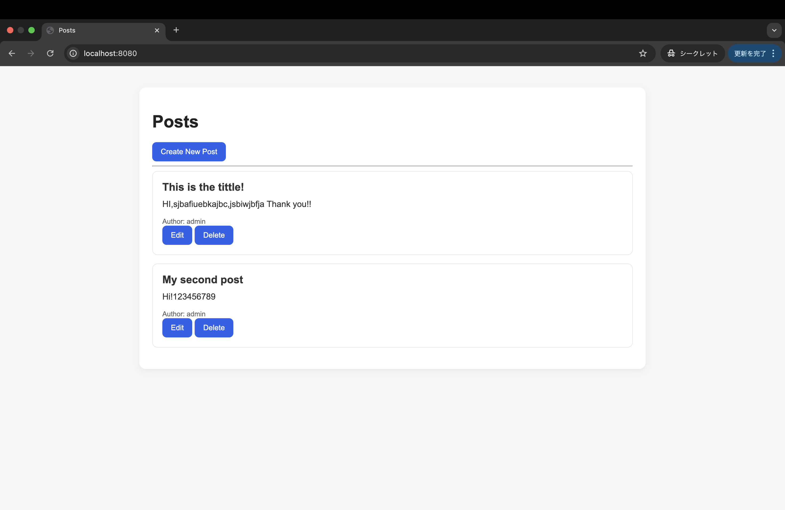
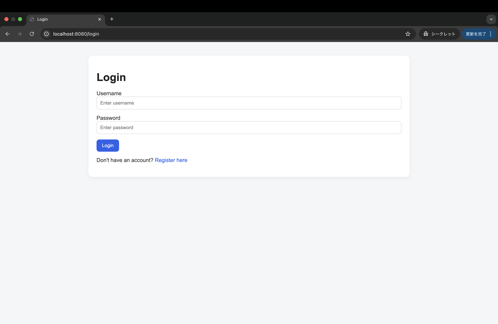
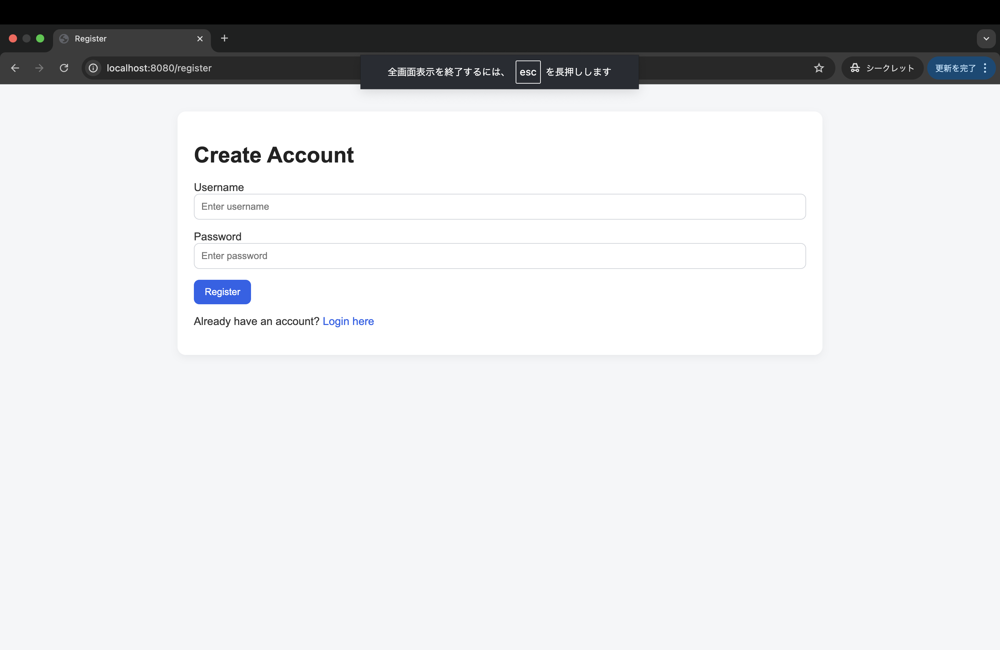
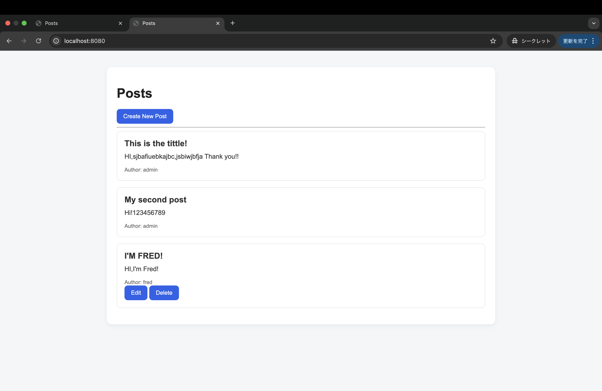

# Simple Bulletin Board Application　簡易的な掲示板アプリ

## Overview　概要

This is a simple bulletin board application with CRUD functionality and user authentication.
It allows users to create, read, update, and delete posts after logging in.

簡易的なCRUD機能とユーザー認証を搭載した掲示板アプリ。
ユーザーに投稿、閲覧、更新、削除をログイン後可能にする。

## Tech Stack　使用技術

* Java
* Spring Boot
* H2 Database (or MySQL)
* Spring Security

## Features　仕様

* User registration and login (unique user)
* Create posts
* View post list
* Edit posts
* Delete posts
* Only the author can edit or delete their own posts

* ユーザー認証とログイン （ユーザー名重複禁止）
* 投稿作成
* 掲示板閲覧
* 投稿編集・削除
* 投稿者のみが編集・削除

## Key Points　特徴

* Designed based on MVC architecture
* Implemented user authentication and authorization
* Established relationships between users and posts
* Prevented unauthorized operations (users can only modify their own posts)

* MVCアーキテクチャに基づいた設計
* ユーザー認証（Authentication）および認可（Authorization）の実装
* ユーザーと投稿間におけるリレーションシップの構築
* 権限管理の徹底（ユーザー本人以外の投稿編集・削除を制限）

## Future Improvements　今後の改善点

* Convert to REST API
* Separate frontend (e.g., React)
* Further improve UI/UX based on user feedback
* Add validation and error handling

* REST APIへの移行
* フロントエンドの分離（Reactなどの導入）
* ユーザー視点に基づいたUI/UXのさらなる改善
* バリデーション（入力チェック）およびエラーハンドリングの追加

## UI/UX Improvement　UI/UX改善

In version 1.1, the UI was improved to make the application easier to use and more visually organized.
A shared CSS file was added, and the layout of the login, registration, post list, and form pages was redesigned.

Version 1.1では、アプリケーションの使いやすさと視認性を高めるためにUI改善を行いました。
共通CSSファイルを追加し、ログイン画面、ユーザー登録画面、投稿一覧画面、投稿フォームのレイアウトを改善しました。

### Improvements　改善内容

* Added a shared CSS file
* Improved login and registration page layout
* Redesigned post list using card-style UI
* Improved form design for creating and editing posts
* Fixed template and layout issues after UI changes

* 共通CSSファイルを追加
* ログイン画面・ユーザー登録画面のレイアウトを改善
* 投稿一覧をカード型UIに変更
* 投稿作成・編集フォームのデザインを改善
* UI変更に伴うテンプレート・レイアウトの不具合を修正

## Motivation　動機

This project was built to practice backend development, including authentication, database design, and CRUD operations.

このプロジェクトは、認証機能、データベース設計、およびCRUD操作を含むバックエンド開発の習得を目的として作成しました。


## Version History　バージョン履歴

### v1.1 - UI Improvement　UI改善

* Added shared CSS for consistent design
* Improved screen layout and readability
* Redesigned post list, login, registration, and form pages
* Fixed template rendering issues caused by UI updates

* 共通CSSを追加し、画面全体のデザインを統一
* レイアウトと視認性を改善
* 投稿一覧、ログイン、ユーザー登録、投稿フォーム画面を改善
* UI変更時に発生したテンプレート表示エラーを修正

### v1.0 - Initial Release　初期リリース

* Implemented user registration and login
* Implemented CRUD functionality for posts
* Added authorization so only authors can edit or delete their own posts

* ユーザー登録・ログイン機能を実装
* 投稿の作成・閲覧・編集・削除機能を実装
* 投稿者本人のみ編集・削除できる認可制御を実装

## Screenshots

### 投稿一覧画面


### ログイン画面


### 新規投稿画面


### 投稿一覧（別ユーザー視点）画面


## How to Run / 実行方法

```bash
git clone https://github.com/sirokuma-cloud/bulletin-board-application.git
cd bulletin-board-application
./mvnw spring-boot:run

Access the application at:http://localhost:8080

## Development Challenges / 苦労した点

- Spring Security導入後、ログインユーザーと投稿者情報の紐付けでエラーが発生したため、認証情報の取得方法とEntity間のリレーションを見直した。
- 投稿者本人のみ編集・削除できるようにするため、Controller側とThymeleaf側の両方で権限チェックを行った。
- UI改善時にテンプレートエラーが発生したため、Thymeleafの式と認証情報の扱いを確認しながら修正した。
